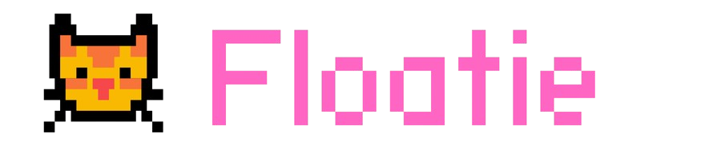

# 🐈 floatie

**Floatie** is an open-source desktop pet platform that lets you add animated characters to your screen — from cats to custom creatures. Lightweight, fun, and fully customizable.

> This repository is **under DEVELOPMENT**. You can see codes that don't work at all or are half functional, half non-functional... or nothing at all? You've been warned! 😺

## 🔧 Roadmap

- 😼 **Customizable pets** - Add your own characters, not just cats!
- 🌌 **Multi-OS support** - There are too many alternatives for Windows but I am gonna do best for my Linux using fellas.
- 🚶 **Multiple animation states** - Walking, running, idle, and more!
- 🧠 **AI generated chat** - Talk to your pet like they are real.

and more!
## Lisans

[MIT](https://choosealicense.com/licenses/mit/) — Steal responsibly.
